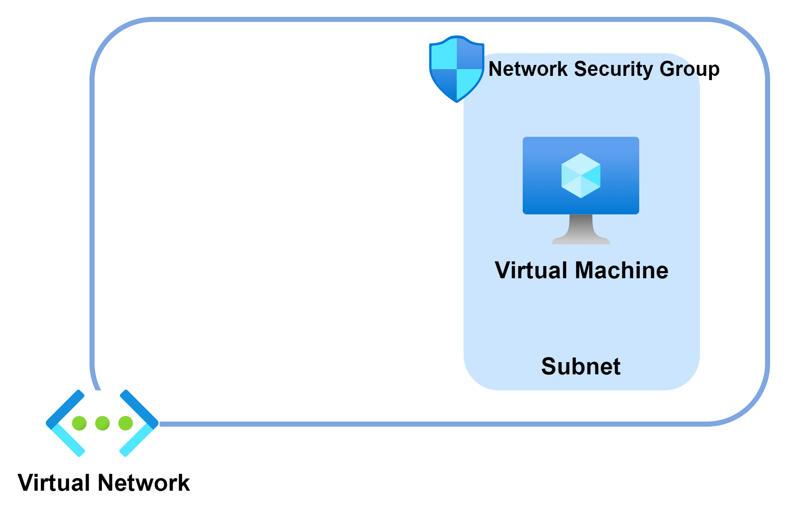
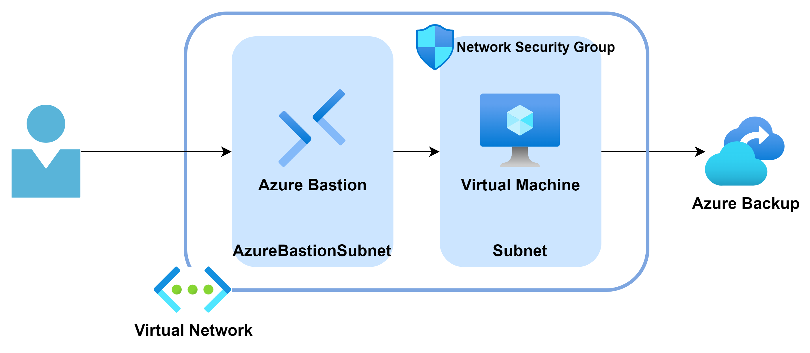

### 参考情報
- [名前付け規則を定義する](https://learn.microsoft.com/ja-jp/azure/cloud-adoption-framework/ready/azure-best-practices/resource-naming)
- [Azure リソースの種類に推奨される省略形](https://learn.microsoft.com/ja-jp/azure/cloud-adoption-framework/ready/azure-best-practices/resource-abbreviations)

 

### Contents

- [Exercise 1: リソースグループ、仮想ネットワーク作成、ストレージアカウントの作成](#exercise-1-リソースグループ、仮想ネットワーク作成、ストレージアカウントの作成)

- [Exercise 2: 仮想マシンの展開と構成](#exercise-2-仮想マシンの展開と構成)

- [Exercise 3: Bastion を使用した仮想マシンへの接続](#exercise-3-bastion-を使用した仮想マシンへの接続)

- [Exercise 4: 仮想マシンのバックアップ](#exercise-4-仮想マシンのバックアップ)

- [Exercise 5: 仮想マシンのリストア](#exercise-5-仮想マシンのリストア)

- [（Option）: 仮想マシンのバックアップ](#Option-仮想マシンのバックアップ)

 

## Exercise 1: リソースグループ、仮想ネットワーク作成、ストレージアカウントの作成

### Task 1: リソースグループ作成

- Azureポータル上部の検索窓から **「リソースグループ」** を検索

  

- **リソースグループ** の **作成** をクリック

  

- リソースグループの作成
    - 基本
        - サブスクリプション：（ハンズオン用に用意されるもの）
        - リソースグループ：（任意名）
        - リージョン：`japan east`

          
    - タグ
    
      特に指定はせず次へ
    
    - 確認及び作成

      内容を確認して作成

 

### Task 2: 仮想ネットワーク作成

- Azure ポータル上部の検索窓で **「仮想ネットワーク」** を検索して選択
  
  

- 「作成」を選択
  
  

- 仮想ネットワークを作成
    - 「基本ページ」で以下を設定して次へ
        - サブスクリプション：（ハンズオンで利用予定のもの）
        - リソースグループ：（作成済みのもの）
        - 名前：（任意、仮想ネットワークの名前）
        - 地域：`Japan East`

            
    
    - 「IPアドレス」ページで以下を設定して次へ
        - IPv4アドレス空間：（任意。プライベートIPアドレス空間推奨）
        - サブネット：（任意。仮想マシン用のサブネットを定義）
          
          

    - セキュリティ
        
        特に指定なし
    
    - タグ

        特に指定なし

    - 確認および作成

        内容を確認して「作成」
  
   

### Task 3: ストレージアカウントの作成

- Azureポータルで **ストレージアカウント** と検索し、**作成** をクリック

  

- ストレージアカウントの作成

  - 基本情報

    - サブスクリプション：（ハンズオン用に用意されるもの）

    - リソースグループ：（作成したリソースグループ）

    - ストレージアカウント名：一意の名前

    ※その他デフォルトのまま

      
  
   

## Exercise 2: 仮想マシンの展開と構成

### Task 1: 仮想マシンの展開

- **リソースの作成** をクリック

  

- **仮想マシン** の **作成** をクリック

- 仮想マシンの作成

  - **基本**

    - **プロジェクトの詳細**

      - **サブスクリプション**: ワークショップで使用中のサブスクリプション

      ‐ **リソース グループ**: ワークショップで使用中のリソース グループ

    - **インスタンスの詳細**

      - **仮想マシン名**: 任意

      - **地域**: 仮想ネットワークを展開した地域を選択

      - **可用性オプション**: インフラストラクチャ冗長は必要ありません

      - **セキュリティの種類**: Standard

      - **イメージ**: Windows Server 2022 Datacenter - x64 Gen2

      - **VM アーキテクチャ**: x64

      - **サイズ**: 任意（2 vcpu 数のサイズを選択）

    - **管理者アカウント**

      - **ユーザー名**: 任意

      - **パスワード**: 英大文字・小文字、数字、特殊文字の 3 つを含む 1 ～ 20 文字

    - **受信ポートの規則**

      - **パブリック受信ポート**: なし

      

 

  - **ディスク** 

    - **OS ディスク**

      - **OS ディスクの種類**: Standard SSD

      - **VM と共に削除**: オン

      

 

  - **ネットワーク**

    - **ネットワーク インターフェイス**

      - **仮想ネットワーク**: 作成した仮想ネットワークを選択

      - **サブネット**: 仮想ネットワーク内のサブネットを選択

      - **パブリック IP**: なし

      - **NIC ネットワーク セキュリティ グループ**: なし

      - **VM が削除されたときに NIC を削除する**: オン
    
    - **負荷分散**

      - **負荷分散のオプション**: なし

      

 

  - **管理**

    既定の設定のまま

    

 

  - **監視**

    既定の設定のまま

    

 

  - **詳細**

    既定の設定のまま

    

- **確認および作成** をクリック、指定した内容を確認し **作成** をクリック

  

 

### Task 2: 静的 IP アドレスの割り当て

- 作成した仮想マシンの管理ブレードへ移動し、**ネットワーク/ネットワーク設定** を選択

- ネットワーク インターフェイスをクリック

  

- **IP 構成** を選択し **ipconfig1** をクリック

  

- **IP 構成の編集** の **プライベート IP アドレスの設定** ‐ **割り当て** で **静的** を選択

  任意のプライベート IP アドレスを指定（現在割り当て中のものでも OK）

  

- **保存** をクリックし、プライベート IP アドレスの割り当てが静的に変更されたことを確認

  

 

### Task 3: ディスクの追加

- 仮想マシンの管理ブレードで **ディスク** を選択、**＋ 新しいディスクを作成し接続する** をクリック

  

- ディスク名を入力し、種類とサイズを指定

  

  ※ 新しいディスクの初期化は、後の手順で仮想マシンに接続して設定

 

## Exercise 3: Bastion を使用した仮想マシンへの接続

  

### Task 1:Bastion 作成
- Azure ポータルで最初に作成した仮想マシンの画面を開く

- 「Bastion」ページから Bastion 作成

  

### Task 2:Bastion 経由で接続（Azure ポータル）

- Azure ポータルで最初に作成した仮想マシンの画面を開く

- 「概要」ページにある [接続]-[Bastion] を選択

  

- ユーザー名、パスワードを入力して「接続」

    (*) クリップボードへの接続許可アラートが出てくるので「許可」にする

    

- 新しくブラウザが立ち上がって接続できればOK
  

- 画面左の **》** をクリックし、クリップボード アクセス ツール パレットを表示

  ※ ローカル コンピューターからテキストをコピーした場合、クリップボード アクセス ツール パレットに自動表示

- 仮想マシンの画面を全画面表示する際は **Fullscreen** をクリック

  
  
  ※ 全画面表示を解除する際は **Esc** キーを押下

 

- エクスプローラーを起動、C ドライブ直下に新しいフォルダを作成し、フォルダ内に新しいテキスト ファイルを作成

  

  ※ テキスト ファイル内には現在の時刻など任意の文字列を記述し保存

 

## Exercise 4: 仮想マシンのバックアップ

### Task 1: Recovery Services コンテナの作成と構成

- Azure ポータルのトップ画面の検索バーに **ビジネス継続性センター** と入力し、表示される候補の **ビジネス継続性センター** を選択

  

- [管理] > [コンテナー] を選択し、 **＋ コンテナー** をクリック

  

- コンテナーの種類で **Recovery Services vault** を選択し、**続行** をクリック

  

- Recovery Services コンテナーの作成

  - **基本**

    - **プロジェクトの詳細**

      - **サブスクリプション**: ワークショップで使用中のサブスクリプション

      - **リソース グループ**: ワークショップで使用中のリソース グループ

    - **インスタンスの詳細**

      - **資格情報コンテナー名**: 任意

      - **リージョン**: 仮想マシンを展開したリージョン1

        

         

  - **冗長**

    - **リージョンをまたがる復元**： オン

      

     
  
  - **暗号化**

    - 既定の設定のまま

      

     

  - **コンテナーのプロパティ**

    - **不変性を有効にする**: オン

      

       

  - **ネットワーク**

    - **接続方法**: すべてのネットワークからのパブリック アクセスを許可する

      

       

- **確認および作成** をクリック、指定した内容を確認し **作成** をクリック

  

   

### Task 2: ビジネス継続性センターの作成

- ビジネス継続性センターへ移動、**＋ ポリシー** をクリック

  

- **データソースの種類** で **Azure 仮想マシン** を選択し、**コンテナーの選択** をクリック

  

- 作成した Recovery Services コンテナーを選択し **選択** をクリック

  

- **続行** をクリック

  

- ポリシーの作成

  - **ポリシーのサブタイプ**: Standard

  - **Standard 保護**

    - **ポリシー名**: 任意

  - **バックアップ スケジュール**

    - **頻度**: 毎日

    - **時間**: 0:00

    - **タイムゾーン**: (UTC+9:00) 大阪、札幌、東京

  - **インスタント復元**

    - **インスタント回復スナップショットの保有期間**: 1 日

  - **保持期間の範囲**

    - **毎日のバックアップ ポイントの保有期間**: 7 日

    - **毎週のバックアップ ポイントの保有期間**: オン（日曜日、4 週）

    - **毎月のバックアップ ポイントの保有期間**: オン（週ベース、最終日曜日、6 月）

      

       

- **作成** をクリックし、ポリシーを作成

 

### Task 3: バックアップの構成

- ビジネス継続性センターへ移動、**＋ バックアップ** をクリック

  

- ワークロード、バックアップ対象を選択し **バックアップ** をクリック

  - **ワークロード**: Azure
  
  - **データソースの種類**: Azure 仮想マシン

    

     

- バックアップの構成で、**バックアップの有効化** をクリック

  - **ポリシーのサブタイプ**: Standard

  - **バックアップ ポリシー**: 作成したバックアップ ポリシーを選択

  - **仮想マシン**: 追加をクリックし、展開済みの仮想マシンを選択

    

     

- 仮想マシンの管理ブレードから、**バックアップ** を開き、**今すぐバックアップ** をクリック（バックアップの保持期限はデフォルトの値のままでOK）

  ※ バックアップが有効化されている仮想マシンではオンデマンドでバックアップも可

    

 

- エクスプローラーを起動、C ドライブ直下に先ほど作成したフォルダ内のテキストファイルに、現在の時刻など任意の文字列を記述し保存

  

 

## Exercise 5: 仮想マシンのリストア

  

### Task 1: バックアップの復元

- 仮想マシンの管理ブレードから、 **バックアップ** を開き、 **VMの復元** をクリック

  

  - 復元ポイントの選択先：先ほど取得した復元ポイントを選択して、**OK** をクリックし、**復元**をクリック

    - 復元の種類：**新しい仮想マシンの作成** を選択

    - 仮想マシン名：（任意名）

    - サブスクリプション：（ハンズオン用に用意されるもの）

    - リソースグループ：（作成したリソースグループ）

    - 仮想ネットワーク：（作成した仮想ネットワーク）

    - サブネット：（作成したサブネット）

    - ステージングの場所：（作成したストレージアカウント）

      
  
   

### Task 2: バックアップの変更履歴の確認

- Azureポータルで **仮想マシン** と検索し、リストアで作成した新規仮想マシンを確認

  
  
   

- 新規作成した仮想マシンの画面を開き、「概要」ページにある[接続]-[Bastion] を選択

  

   

- ユーザ名、パスワードを入力して「接続」

  

   

- バックアップ前に作成したファイルを開き、バックアップが正常に行われているか確認

  

   

  
